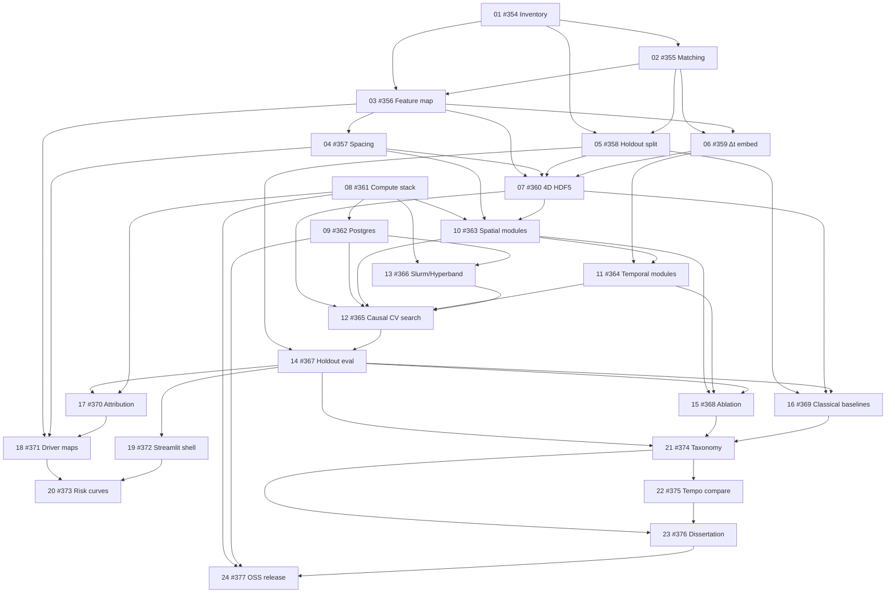

# Bio-NAS Implementation Roadmap

Plans for all **24 open** `phd-sync` roadmap issues in [AdamCankaya/PhDNeural](https://github.com/AdamCankaya/PhDNeural).
Authoritative checklist: [`phd_bio-nas_master_plan.md`](../../phd_bio-nas_master_plan.md).
Live tracker: [PhD Master Plan (Project #2)](https://github.com/users/AdamCankaya/projects/2).

**Plans folder:** `Bio-NAS/docs/plans/`

## Docker-first (all plans)

All implementation work for these plans must be designed to run **inside the Bio-NAS Docker container** (`docker/Dockerfile`, `docker-compose.yml`). Prefer extending the entrypoint, `docker/requirements.txt`, compose env/volumes, and container-invoked scripts over host-only workflows. When a plan adds executable work, include Docker run/repro steps and expected mount outputs. Exceptions (e.g. interactive DUA/browser account setup) must be documented as **out-of-container**.

Agent rule (always apply): [`.cursor/rules/docker-first-implementation.mdc`](../../.cursor/rules/docker-first-implementation.mdc). Compose contract: [`docker/README.md`](../../docker/README.md).

## Intermediate Fusion NAS (multi-omic; supersedes early raw-concat)

The multi-omic PyTorch NAS path upgrades from **Stage 1 early fusion** (raw modality concat into one trunk) to **Intermediate Fusion** (multi-branch) to reduce curse-of-dimensionality and modality dominance. Optuna must tune distinct branches before post-fusion dense layers.

| Step | What | Plan ownership |
|------|------|----------------|
| 1 | Methylation branch — betas, mean-impute NaNs, **no** Z-score/log; `MethEncoder` | Data prep → [07](07-issue-360-four-d-tensor-hdf5.md); module → [10](10-issue-363-spatial-cnn-transformer-modules.md) |
| 2 | RNA branch — `log2(TPM+1)` then Z-score; `RNAEncoder` | Data prep → [07](07-issue-360-four-d-tensor-hdf5.md); module → [10](10-issue-363-spatial-cnn-transformer-modules.md) |
| 3 | `torch.cat((meth_latent, rna_latent), dim=1)` | Train objective → [12](12-issue-365-causal-cv-architecture-search.md) |
| 4 | Post-fusion dense (`FusionDecoder`) → MTL / epigenetic state | Module → [10](10-issue-363-spatial-cnn-transformer-modules.md); **phased Optuna** → [12](12-issue-365-causal-cv-architecture-search.md) |

**Superseded for NAS:** early fusion / flat raw-concat as the default search architecture (`FusionMode.EARLY`, `brca_early_fusion.py`). Keep only as a legacy software baseline. Stage 2 stacked late fusion (OOF experts + ElasticNet) remains a separate ADR-001 path and is not replaced by Intermediate Fusion.

**Phased Optuna (plan 12):** Phase A — independent branch HPs; Phase B — post-fusion dense only (branches frozen / fixed from A). Dual-track A/B (pathway mask) still applies on top.

Storage / workers: [09](09-issue-362-dockerized-postgres-optuna.md) (Postgres), [13](13-issue-366-slurm-hyperband-workers.md) (Slurm/Hyperband). All executable steps remain Docker-first.

## Scope

| Included | Skipped |
|----------|---------|
| All **24 open** issues `#354`–`#377` (`label:phd-sync`) | **Closed** superseded roadmap issues (prior sync generations) |
| | Closed `future-potential` / `consideration` / `infra-algo-exploration` items (not current phd-sync scope) |

## How plans interconnect

**Non-duplication rule:** Foundational work lives in the earliest plan that needs it. Later plans reference earlier ones instead of restating setup (e.g. holdout locking is only in plan 05; Postgres only in plan 09; attribution API only in plan 17; **Track B adjacency build/freeze only in plan 10** — plan 12 consumes the frozen mask in dual-track Optuna search; **Intermediate Fusion loaders/scalings only in plan 07**; **branch/decoder modules only in plan 10**; **phased Optuna + train forward only in plan 12**).

## Implementation order

| Order | Issue | Plan file | Depends on |
|------:|-------|-----------|------------|
| 01 | [#354](https://github.com/AdamCankaya/PhDNeural/issues/354) | [01-issue-354-multi-disease-dataset-inventory.md](01-issue-354-multi-disease-dataset-inventory.md) | — |
| 02 | [#355](https://github.com/AdamCankaya/PhDNeural/issues/355) | [02-issue-355-longitudinal-matching-strategy.md](02-issue-355-longitudinal-matching-strategy.md) | #354 |
| 03 | [#356](https://github.com/AdamCankaya/PhDNeural/issues/356) | [03-issue-356-spatial-temporal-feature-map.md](03-issue-356-spatial-temporal-feature-map.md) | #354, #355 |
| 04 | [#357](https://github.com/AdamCankaya/PhDNeural/issues/357) | [04-issue-357-genomic-structural-spacing.md](04-issue-357-genomic-structural-spacing.md) | #356 |
| 05 | [#358](https://github.com/AdamCankaya/PhDNeural/issues/358) | [05-issue-358-patient-level-holdout-split.md](05-issue-358-patient-level-holdout-split.md) | #354, #355 |
| 06 | [#359](https://github.com/AdamCankaya/PhDNeural/issues/359) | [06-issue-359-delta-t-embedding.md](06-issue-359-delta-t-embedding.md) | #355, #356 |
| 07 | [#360](https://github.com/AdamCankaya/PhDNeural/issues/360) | [07-issue-360-four-d-tensor-hdf5.md](07-issue-360-four-d-tensor-hdf5.md) | #356, #357, #358, #359 |
| 08 | [#361](https://github.com/AdamCankaya/PhDNeural/issues/361) | [08-issue-361-compute-stack-provisioning.md](08-issue-361-compute-stack-provisioning.md) | — |
| 09 | [#362](https://github.com/AdamCankaya/PhDNeural/issues/362) | [09-issue-362-dockerized-postgres-optuna.md](09-issue-362-dockerized-postgres-optuna.md) | #361 |
| 10 | [#363](https://github.com/AdamCankaya/PhDNeural/issues/363) | [10-issue-363-spatial-cnn-transformer-modules.md](10-issue-363-spatial-cnn-transformer-modules.md) | #357, #360, #361 (+ owns Track B adjacency freeze) |
| 11 | [#364](https://github.com/AdamCankaya/PhDNeural/issues/364) | [11-issue-364-temporal-progression-modules.md](11-issue-364-temporal-progression-modules.md) | #359, #363 |
| 12 | [#365](https://github.com/AdamCankaya/PhDNeural/issues/365) | [12-issue-365-causal-cv-architecture-search.md](12-issue-365-causal-cv-architecture-search.md) | #360, #362, #363, #364 (consumes frozen adjacency from #363) |
| 13 | [#366](https://github.com/AdamCankaya/PhDNeural/issues/366) | [13-issue-366-slurm-hyperband-workers.md](13-issue-366-slurm-hyperband-workers.md) | #361, #362 |
| 14 | [#367](https://github.com/AdamCankaya/PhDNeural/issues/367) | [14-issue-367-holdout-trajectory-evaluation.md](14-issue-367-holdout-trajectory-evaluation.md) | #358, #365 |
| 15 | [#368](https://github.com/AdamCankaya/PhDNeural/issues/368) | [15-issue-368-spatial-vs-spatiotemporal-ablation.md](15-issue-368-spatial-vs-spatiotemporal-ablation.md) | #363, #364, #367 |
| 16 | [#369](https://github.com/AdamCankaya/PhDNeural/issues/369) | [16-issue-369-classical-longitudinal-baselines.md](16-issue-369-classical-longitudinal-baselines.md) | #358, #360, #367 |
| 17 | [#370](https://github.com/AdamCankaya/PhDNeural/issues/370) | [17-issue-370-multidim-attribution-pipeline.md](17-issue-370-multidim-attribution-pipeline.md) | #361, #367 |
| 18 | [#371](https://github.com/AdamCankaya/PhDNeural/issues/371) | [18-issue-371-cpg-timestamp-driver-maps.md](18-issue-371-cpg-timestamp-driver-maps.md) | #356, #357, #370 |
| 19 | [#372](https://github.com/AdamCankaya/PhDNeural/issues/372) | [19-issue-372-streamlit-trajectory-shell.md](19-issue-372-streamlit-trajectory-shell.md) | #367 |
| 20 | [#373](https://github.com/AdamCankaya/PhDNeural/issues/373) | [20-issue-373-trajectory-risk-curves.md](20-issue-373-trajectory-risk-curves.md) | #371, #372 |
| 21 | [#374](https://github.com/AdamCankaya/PhDNeural/issues/374) | [21-issue-374-structural-taxonomy-docs.md](21-issue-374-structural-taxonomy-docs.md) | #367, #368, #369 |
| 22 | [#375](https://github.com/AdamCankaya/PhDNeural/issues/375) | [22-issue-375-slow-vs-fast-architecture-compare.md](22-issue-375-slow-vs-fast-architecture-compare.md) | #374 |
| 23 | [#376](https://github.com/AdamCankaya/PhDNeural/issues/376) | [23-issue-376-finalize-dissertation.md](23-issue-376-finalize-dissertation.md) | #374, #375 |
| 24 | [#377](https://github.com/AdamCankaya/PhDNeural/issues/377) | [24-issue-377-oss-framework-release.md](24-issue-377-oss-framework-release.md) | #361, #362, #376 |

## Phase / year grouping

| Group | Plans | Focus |
|-------|-------|-------|
| Year 1 Fall–Winter | 01–04 | Cohort inventory, matching, feature map, spacing |
| Year 1 Spring–Summer | 05–09 | Leakage-safe ETL, Δt, 4D HDF5, compute, Postgres |
| Year 2 Fall–Spring | 10–13 | Spatial/temporal + Intermediate Fusion modules, phased Optuna search, Slurm workers |
| Year 2 Summer | 14–16 | Holdout eval, ablations, classical baselines (**scaling gate**) |
| Year 3 Fall–Winter | 17–20 | Attribution, driver maps, Streamlit trajectories |
| Year 3 Spring–Summer | 21–24 | Taxonomy, tempo compare, dissertation, OSS release |

## Existing code foundations (do not rebuild)

Already present and referenced by early plans rather than re-scoped as new issues:

- Static MTL contract: `src/models/static_mtl_model.py`, `src/models/losses.py`
- BRCA dataset scaffold: `src/data/brca_dataset.py`, `src/data/clinical_time.py` (extend for Intermediate Fusion batch fields in plan 07)
- Legacy early fusion: `src/models/brca_early_fusion.py` (**superseded for NAS** by Intermediate Fusion in plans 10/12)
- Disease registry placeholders: `src/config/disease_registry.yaml`
- Wiki runbooks: `docs/wiki/*`

## Related links

- [README](../../README.md)
- [Roadmap and Tracking (wiki)](../wiki/Roadmap-and-Tracking.md)
- [Code Map and Status](../wiki/Code-Map-and-Status.md)
- [Architecture Decisions](../wiki/Architecture-Decisions.md)
