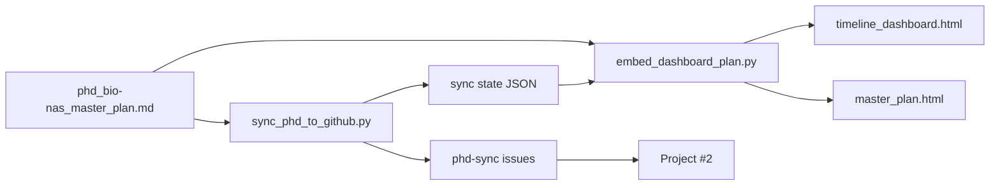

# Workflow

This page describes the **one-way sync loop** from the master plan to GitHub tracking and published Pages artifacts.

## Source-of-truth chain



1. **Edit** [`phd_bio-nas_master_plan.md`](https://github.com/AdamCankaya/PhDNeural/blob/main/Bio-NAS/phd_bio-nas_master_plan.md) — authoritative roadmap (**24** checklist tasks). Nested bullets under each item become implementation requirements.
2. **Test** locally:

   ```powershell
   cd Bio-NAS
   python -m unittest discover -s tests -v
   ```

3. **Sync to GitHub** — creates/updates issues and Project #2 cards:

   ```powershell
   python scripts/sync_phd_to_github.py --update-existing --close-stale --prune-project
   ```

4. **Regenerate dashboard + master plan HTML** (embeds issue URLs from sync state):

   ```powershell
   python scripts/embed_dashboard_plan.py
   ```

   Dashboard version: **`phd_plan_progress_v8`**. Clear browser `localStorage` for the dashboard page if progress looks stale after a major rewrite.

5. **Publish** — commit/push `main` for GitHub Pages (`/Bio-NAS/…`) and wiki (`docs/wiki/**` or `python scripts/publish_wiki.py`).

> **One-way sync:** Closing an issue does **not** update `phd_bio-nas_master_plan.md`. The plan file is always the source of truth.

## Alignment contract

| Check | Expected |
|-------|----------|
| `python scripts/sync_phd_to_github.py --parse-only` | **24** tasks |
| Open issues `label:phd-sync` | **24** |
| Dashboard embedded tasks with `issue_url` | **24** |
| `phd_bio-nas_master_plan.html` linked items | **24** |

## Configuration

```powershell
Copy-Item bio-nas_github_sync.config.json.example bio-nas_github_sync.config.json
```

| Setting | Example |
|---------|---------|
| `GITHUB_OWNER` | `AdamCankaya` |
| `GITHUB_REPO` | `PhDNeural` |
| `GITHUB_PROJECT_NUMBER` | `2` |
| `GITHUB_PROJECT_SCOPE` | `user` |

Authenticate via `gh auth login` (recommended) or `GITHUB_TOKEN` env var.

## Preview and dry run

```powershell
python scripts/sync_phd_to_github.py --dry-run --verify-remote
python scripts/publish_wiki.py --dry-run
```

## Wiki publish workflow

Wiki pages in `docs/wiki/` auto-publish on push to `main` when `Bio-NAS/docs/wiki/**` changes. Manual publish:

```powershell
python scripts/publish_wiki.py --dry-run
python scripts/publish_wiki.py
```

## Related pages

- [Roadmap and Tracking](Roadmap-and-Tracking)
- [FAQ and Troubleshooting](FAQ-and-Troubleshooting)
- [Home](Home)
