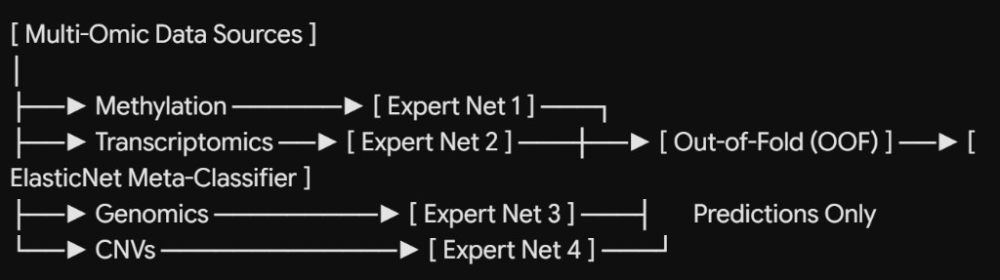

# PhDNeural

**Two-Stage Multi-Omic Fusion Neural Architecture Search**

A PhD research program that builds a generalized, multi-task Neural Architecture Search (NAS) framework using a **vertical slice** methodology on Breast Invasive Carcinoma (BRCA). Phase 1 follows a strict **two-stage evolution**: Stage 1 stress-tests the full pipeline via **Early Fusion (concatenation)**; Stage 2 upgrades to a **Stacked Late Fusion Ensemble** with modality-specific expert networks and an ElasticNet meta-classifier trained on clean Out-of-Fold predictions. The framework uses [Optuna](https://optuna.org/) for distributed NAS, ingests multi-omic patient data through a unified (then generalized) pipeline, and delivers Multi-Task Learning (MTL) models with an end-to-end [Streamlit](https://streamlit.io/) inference portal.

| Resource | Link |
|----------|------|
| Repository | [github.com/AdamCankaya/PhDNeural](https://github.com/AdamCankaya/PhDNeural) |
| Project board | [PhD Master Plan (Project #2)](https://github.com/AdamCankaya/PhDNeural/projects/2) |
| Live dashboard | [adamcankaya.github.io/PhDNeural/phd_timeline_dashboard.html](https://adamcankaya.github.io/PhDNeural/phd_timeline_dashboard.html) |
| Master plan | [phd_master_plan.md](phd_master_plan.md) |

---

## Executive Strategy

To minimize engineering risk and isolate computational bugs, the BRCA anchor pipeline follows a strict two-stage evolution:

| Stage | Approach | Purpose |
|-------|----------|---------|
| **Stage 1 — Early Fusion (Software Baseline)** | Immediate feature concatenation: $X_{\text{fused}} = [X_{\text{methylation}} \parallel X_{\text{transcriptomics}} \parallel X_{\text{genomics}} \parallel X_{\text{cnv}} \parallel X_{\text{clinical}}]$ through an MLP trunk | Stress-test HDF5 ingestion, PyTorch tensor formatting, three MTL heads, and distributed Optuna logging on Hetzner PostgreSQL |
| **Stage 2 — Stacked Late Fusion (Algorithmic Production)** | 4 modality-specific expert networks + ElasticNet meta-classifier on **Out-of-Fold (OOF)** predictions | Eliminate data leakage; learn interpretable biological weights via sparse $L_1/L_2$ coefficients |

---

## 1. Project Goals

### Research question

**Does biological etiology dictate optimal neural architecture?**

The central hypothesis is that disease topology—localized oncological mutation burden (BRCA), systemic neurological degradation, immune-driven inflammation, metabolic dysregulation, and chromosomal developmental variation—should favor structurally different computational graphs. A BRCA-first vertical slice validates the full two-stage fusion pipeline before scaling to four additional categories.

### Roadmap phases

| Phase | Theme |
|-------|-------|
| **Phase 1 — BRCA anchor** | Stage 1 early fusion baseline → Stage 2 stacked late fusion with OOF + ElasticNet meta-classifier |
| **Phase 2 — Abstraction** | Refactor hardcoded BRCA code into a universal disease pipeline with dynamic omic branches and MTL heads |
| **Phase 3 — Scaling** | Deploy generalized pipeline to Alzheimer's, rheumatoid arthritis, type 2 diabetes, and Down syndrome |
| **Phase 4 — Thesis** | Comparative structural taxonomy, SHAP interpretability, and Streamlit patient portal |

### Objectives

| Objective | Description |
|-----------|-------------|
| **Stage 1 software baseline** | End-to-end early fusion on TCGA BRCA with 80/20 train/holdout split, variance masks on train only, three MTL heads, Optuna verification on Hetzner |
| **Stage 2 stacked fusion** | 4 expert nets (1D-CNN methylation, MLP RNA, sparse linear genomics/CNV), 5-fold OOF loop, ElasticNet meta-classifier with Optuna-tuned $\lambda$ and $\alpha$ |
| **Comparative NAS** | Run Optuna define-by-run NAS across five disease categories after abstraction |
| **Multi-omic ingestion** | Methylation, transcriptomics, genomics, CNVs, demographics; omit unavailable omic layers per cohort without breaking the network |
| **Distributed execution** | Central PostgreSQL study store on Hetzner; Slurm workers via GitHub Actions CI/CD |
| **Inference portal** | Streamlit web application for disease-track selection, patient data upload, and MTL prediction output |

---

## 2. Expected Input and Output

### Inputs (BRCA anchor, then generalized)

| Input type | Formats | Examples |
|------------|---------|----------|
| Raw omic files | `.CSV`, `.TXT`, VCF, HDF5 | Methylation beta-value matrices, RNA-Seq FPKM/TPM tables, somatic mutation VCFs, CNV log2 ratio files |
| Clinical / demographic tabular data | `.CSV`, tabular joins | Age, sex, ethnicity, tumor stage, survival days |
| Labels & targets | Per-disease schema | Tumor vs. normal (diagnostic), stage I–IV (ordinal), days to live with censoring (prognostic) |

**Preprocessing constraints (training set only):**

- Strict **20% holdout test set** extracted before any preprocessing
- Variance-based reduction to top 10,000 highly variable CpG sites computed **only on the 80% training partition**
- Demographics: Z-score standardization (continuous); one-hot encoding (categorical)

### Outputs

| Output | Description |
|--------|-------------|
| **Stage 1 early fusion model** | Concatenated MLP with three MTL heads; Optuna trial metadata in PostgreSQL |
| **Stage 2 stacked ensemble** | 4 expert networks + ElasticNet meta-classifier; sparse coefficient interpretability chart |
| **MTL predictions** | Disease probability (diagnostic), predicted stage (ordinal), prognostic timeline (Cox-PH) |
| **OOF meta-features** | Clean $P_{\text{OOF}}$ matrix covering full 80% train set with zero leakage |
| **Streamlit inference** | Interactive predictions from uploaded patient demographics and available raw omic files |

---

## 3. Planned Phases

The roadmap follows four phases in [phd_master_plan.md](phd_master_plan.md).

### Phase 1 — The Anchor (BRCA Proof of Concept)

**Theme:** Two-stage fusion evolution on TCGA BRCA before generalizing.

| Stage / Step | Focus | Key deliverables |
|--------------|-------|------------------|
| **Stage 1** | Early Fusion Proof-of-Concept | 20% holdout; train-only variance masks; HDF5 concat pipeline; MLP trunk; BCE / ordinal / Cox-PH heads; Optuna verification on Hetzner |
| **Stage 2** | Stacking Late Fusion Upgrade | 4 expert nets; 5-fold OOF loop; ElasticNet meta-classifier (`penalty='elasticnet'`, `solver='saga'`); sparse coefficient interpretability |

### Phase 2 — Code Abstraction & Generalization

**Theme:** Transition BRCA-specific code into a universal disease pipeline.

| Step | Focus | Key deliverables |
|------|-------|------------------|
| **1** | Refactoring base classes | Dynamic omic-layer detection in `Dataset`; adaptive MTL heads for disease-specific clinical targets |

### Phase 3 — Scaling to the Comparative Matrix

**Theme:** Run four parallel Optuna studies on the generalized pipeline.

| Step | Focus | Key deliverables |
|------|-------|------------------|
| **1** | Sourcing 4 pathologies | Alzheimer's (GEO), rheumatoid arthritis (GEO), type 2 diabetes (GEO/recountmethylation), Down syndrome (GEO) |
| **2** | High-throughput distributed execution | 4 parallel Optuna studies against Hetzner PostgreSQL |

### Phase 4 — Thesis Synthesis & Final Deliverables

**Theme:** Comparative analysis, interpretability, and patient-facing software.

| Step | Focus | Key deliverables |
|------|-------|------------------|
| **1** | Comparative analysis (core thesis) | Structural taxonomy; SHAP omic-layer importance |
| **2** | Patient-facing software app | Streamlit dashboard: disease track selection, multi-omic CSV upload, phenotype/stage/prognosis output |

---

## 4. Technical Specifications

### Fusion architectures

| Stage | Architecture | Fusion mechanism |
|-------|-------------|------------------|
| **Stage 1 (Early Fusion)** | Single MLP trunk on concatenated features | $X_{\text{fused}} = \text{concat}(\text{all modalities})$ |
| **Stage 2 (Late Fusion)** | 4 isolated expert networks + meta-classifier | Expert predictions → $P_{\text{OOF}}$ → ElasticNet LogisticRegression |

### Expert networks (Stage 2)

| Modality | Expert architecture | Output |
|----------|---------------------|--------|
| **Methylation** | 1D-CNN | Multi-task predictions |
| **Transcriptomics (RNA-Seq)** | Deep MLP | Multi-task predictions |
| **Genomics / CNV** | Sparse linear network | Multi-task predictions |

### OOF anti-leakage protocol

1. Hold out **20% test set** before any preprocessing.
2. On the remaining **80% train pool**, run **5-fold stratified CV**.
3. For each fold $k$: train all 4 experts on folds $\neq k$; predict only on fold $k$.
4. Concatenate fold-$k$ predictions → complete **$P_{\text{OOF}}$** matrix (no model ever predicts on its own training data).
5. Train ElasticNet meta-classifier on $P_{\text{OOF}}$ only.
6. Retrain experts on full 80%; evaluate meta-classifier on locked 20% holdout.

### MTL heads & losses

| Head | Loss | Target |
|------|------|--------|
| **Diagnostic** | Binary cross-entropy | Tumor vs. normal matched tissue |
| **Staging** | Ordinal log-loss | Stage I, II, III, or IV |
| **Prognostic** | Cox proportional hazards (Cox-PH) | Survival timeline with censored data |

### ElasticNet meta-classifier

| Setting | Value |
|---------|-------|
| Estimator | `LogisticRegression(penalty='elasticnet', solver='saga')` |
| Tuning | Optuna search over $\lambda$ (inverse `C`) and $\alpha$ (`l1_ratio`) |
| Interpretability | Inspect sparse non-zero coefficients $w$ for expert-network weights |

### Code structure

| Module | Path | Responsibility |
|--------|------|----------------|
| Dataset loader | `src/data/brca_dataset.py` | Switch between flat concat tensor (Stage 1) and modality dict (Stage 2) |
| Early fusion model | `src/models/brca_early_fusion.py` | Stage 1 `torch.cat` + MLP trunk + 3 MTL heads |
| Stacking pipeline | `src/pipelines/train_stacking.py` | Stage 2 5-fold OOF loop + sklearn ElasticNet meta-classifier |

### Disease categories (5 — BRCA first, then 4)

| Category | Disease | Primary source |
|----------|---------|----------------|
| **Oncological (anchor)** | Breast Invasive Carcinoma (BRCA) | [TCGA / GDC Portal](https://portal.gdc.cancer.gov/) |
| **Neurological** | Alzheimer's Disease | [NCBI GEO](https://www.ncbi.nlm.nih.gov/geo/) |
| **Autoimmune** | Rheumatoid Arthritis | [NCBI GEO](https://www.ncbi.nlm.nih.gov/geo/) |
| **Metabolic** | Type 2 Diabetes | [NCBI GEO](https://www.ncbi.nlm.nih.gov/geo/) / [recountmethylation](https://bioconductor.org/packages/recountmethylation/) |
| **Genetic / Developmental** | Down Syndrome | [NCBI GEO](https://www.ncbi.nlm.nih.gov/geo/) |

---

## 5. Data Sources & Open Source Software

### Data sources

| Resource | URL | Use in PhDNeural |
|----------|-----|------------------|
| **TCGA / GDC Portal** | [portal.gdc.cancer.gov](https://portal.gdc.cancer.gov/) | BRCA anchor multi-omic and clinical data |
| **NCBI GEO** | [ncbi.nlm.nih.gov/geo](https://www.ncbi.nlm.nih.gov/geo/) | Phase 3 disease cohorts |
| **recountmethylation** | [bioconductor.org/packages/recountmethylation](https://bioconductor.org/packages/recountmethylation/) | Type 2 diabetes methylation data |

### Software stack

| Package / tool | URL | Role |
|----------------|-----|------|
| **PyTorch** | [pytorch.org](https://pytorch.org/) | Early fusion MLP, expert networks, MTL heads |
| **Optuna** | [optuna.org](https://optuna.org/) | Define-by-run NAS, ElasticNet hyperparameter tuning, distributed study management |
| **scikit-learn** | [scikit-learn.org](https://scikit-learn.org/) | OOF stacking, ElasticNet meta-classifier, preprocessing |
| **XGBoost** | [xgboost.readthedocs.io](https://xgboost.readthedocs.io/) | Classical tree-based benchmark |
| **LightGBM** | [lightgbm.readthedocs.io](https://lightgbm.readthedocs.io/) | Classical tree-based benchmark |
| **PostgreSQL** | [postgresql.org](https://www.postgresql.org/) | Central Optuna study database (Hetzner) |
| **Docker** | [docker.com](https://www.docker.com/) | Containerized PostgreSQL hub |
| **Streamlit** | [streamlit.io](https://streamlit.io/) | Patient inference web portal |
| **SHAP** | [github.com/shap/shap](https://github.com/shap/shap) | Model interpretability |

### Repository tooling

| Component | Location | Purpose |
|-----------|----------|--------|
| Master plan | [phd_master_plan.md](phd_master_plan.md) | Authoritative two-stage roadmap and task checklist |
| Architecture diagram | [docs/architecture-stacked-fusion.png](docs/architecture-stacked-fusion.png) | Stage 2 stacked late fusion schematic |
| Timeline dashboard | [phd_timeline_dashboard.html](phd_timeline_dashboard.html) | Interactive 4-phase progress tracker ([live](https://adamcankaya.github.io/PhDNeural/phd_timeline_dashboard.html)) |
| GitHub Projects sync | `scripts/sync_phd_to_github.py` | Sync plan tasks to [project board #2](https://github.com/AdamCankaya/PhDNeural/projects/2) |
| Setup guide | [GITHUB_PROJECTS_SETUP.md](GITHUB_PROJECTS_SETUP.md) | GitHub Projects v2 configuration and sync workflow |
| CI sync workflow | `.github/workflows/sync-phd-plan.yml` | Manual GitHub Actions re-sync trigger |

---

## License & citation

This repository documents an active PhD research program. Citation and licensing details will be added upon framework release (Phase 4).
