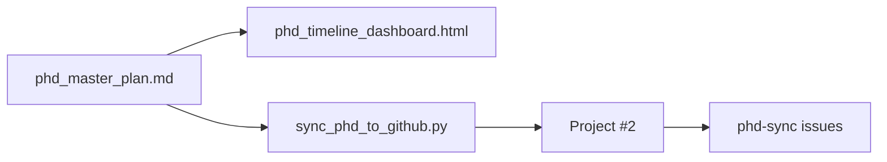

# Workflow

This page describes the **one-way sync loop** from the master plan to GitHub tracking. Full setup details live in the repository; this wiki is the canonical published guide.

## Source-of-truth chain



1. **Edit** [`phd_master_plan.md`](https://github.com/AdamCankaya/PhDNeural/blob/main/phd_master_plan.md) — authoritative roadmap (43 checklist tasks, semester-first).
2. **Regenerate dashboard** (optional but recommended after plan edits):

   ```powershell
   python scripts/embed_dashboard_plan.py
   ```

   Dashboard version: **`phd_plan_progress_v7`** (semester nesting). If the board looks stale after a major rewrite, clear browser `localStorage` for the dashboard page.

3. **Sync to GitHub** — creates/updates issues and Project #2 cards:

   ```powershell
   python scripts/sync_phd_to_github.py
   ```

4. **Track progress on the board** — drag cards Todo → In Progress → Done; close linked issues when complete.

> **One-way sync:** Closing an issue does **not** update `phd_master_plan.md`. The plan file is always the source of truth.

## Additive default

By default, sync is **additive**:

- New checklist items → new issues with `phd-sync` label
- Existing sync-ids (in `<!-- phd-sync-id: ... -->` body markers) → skipped or updated with `--update-existing`
- Removed plan items → issues stay **open** unless you pass `--close-stale`

Recommended flags after editing existing task text:

```powershell
python scripts/sync_phd_to_github.py --update-existing
```

## GitHub tracking alignment (Jun 2026)

| Check | Result |
|-------|--------|
| `python scripts/sync_phd_to_github.py --parse-only` | **43 tasks** parsed (semester-first IDs) |
| Local `github_sync.config.json` | Not required; copy from [`github_sync.config.json.example`](https://github.com/AdamCankaya/PhDNeural/blob/main/github_sync.config.json.example) or set env vars |
| `gh auth` | Works locally (`repo`, `project` scopes) |
| Remote issue count verification | **Blocked by API rate limit** at wiki publish time — verify manually: [issues labeled `phd-sync`](https://github.com/AdamCankaya/PhDNeural/issues?q=label%3Aphd-sync) |

**Prune sync** (`--prune-project --update-existing --reset-status-todo`) was **not run** during wiki bootstrap because rate limits prevented confirming whether the board still holds stale phase-based sync-ids from the pre-semester rewrite. Run manually when the API quota resets and issue count ≠ 43:

```powershell
python scripts/sync_phd_to_github.py --prune-project --update-existing --reset-status-todo
```

## Configuration

Copy and edit local config (never commit tokens):

```powershell
Copy-Item github_sync.config.json.example github_sync.config.json
```

| Setting | Example |
|---------|---------|
| `GITHUB_OWNER` | `AdamCankaya` |
| `GITHUB_REPO` | `PhDNeural` |
| `GITHUB_PROJECT_NUMBER` | `2` |
| `GITHUB_PROJECT_SCOPE` | `repository` |

Authenticate via `gh auth login` (recommended) or `GITHUB_TOKEN` env var.

## Preview and dry run

```powershell
# Parse only — no credentials
python scripts/sync_phd_to_github.py --parse-only

# Local dry run
python scripts/sync_phd_to_github.py --dry-run

# Dry run + query GitHub for existing issues
python scripts/sync_phd_to_github.py --dry-run --verify-remote
```

## Project board setup

- **Board URL:** [PhD Master Plan (Project #2)](https://github.com/AdamCankaya/PhDNeural/projects/2)
- **Recommended grouping:** **Year** or **Semester** (set manually in GitHub UI — API cannot set default view)
- **Custom fields:** Year, Semester, Phase, Step, Status (Todo / In Progress / Done)

## Issue title format

Synced issues use semester-prefixed titles:

```
[Y1 Summer 2026] Source: TCGA (Level 3 Open Access).
[Y2 Summer 2027] src/pipelines/train_stacking.py — Stage 2 five-fold OOF loop...
```

Body includes `<!-- phd-sync-id: year-1-summer-2026-phase-1-step-1-item-1-... -->` for idempotent matching.

## CI sync workflow

Manual trigger: **Actions → Sync PhD Plan to GitHub Projects → Run workflow** (`.github/workflows/sync-phd-plan.yml`).

Set repository **Variables:** `GITHUB_OWNER`, `GITHUB_REPO`, `GITHUB_PROJECT_NUMBER`.

## Wiki publish workflow

Wiki pages in `docs/wiki/` auto-publish on push to `main` (see [FAQ and Troubleshooting](FAQ-and-Troubleshooting)). Manual publish:

```powershell
python scripts/publish_wiki.py --dry-run
python scripts/publish_wiki.py
```

## Related pages

- [Roadmap and Tracking](Roadmap-and-Tracking) — semester calendar and label reference
- [FAQ and Troubleshooting](FAQ-and-Troubleshooting) — rate limits, stale sync-ids, duplicates
